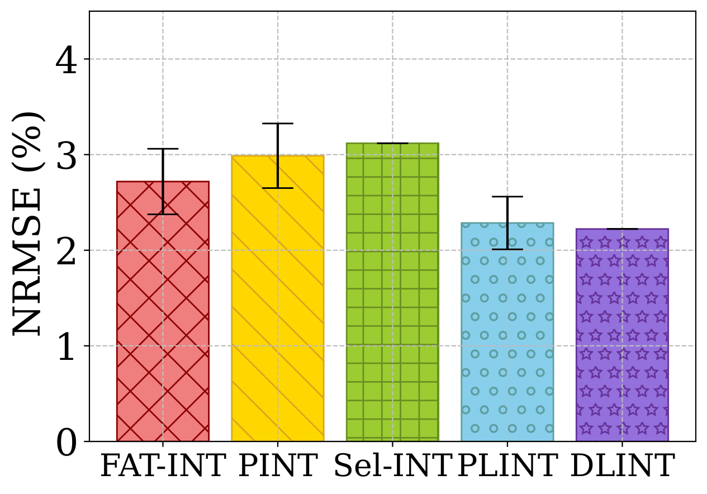

# FAT-INT

  
In-band network telemetry (INT) is a promising technique to investigate the real-time state of networks. However, it inevitably generates considerable transmission overhead due to the operational feature of directly inserting telemetry data into the packet header. One of the widely used methods to alleviate such overhead is sampling, which requires a careful selection of sampling rates to control the trade-off between the monitoring accuracy and the transmission overhead. Meanwhile, INT needs to collect various kinds of telemetry items with varying frequency characteristics, leading to different sampling rates to satisfy the desired monitoring accuracy. To address these issues, we propose a frequency-aware item-wise INT scheme, FAT-INT, which uses a novel approach to consider the frequency characteristics of each telemetry item.

# Performance Results

## BMv2 environments
### Data center networks (Usecase1, $\varepsilon_{th}$ = 3%)
<table>
  <tr>
    <td align="center"></td>
    <td align="center"></td>
    <td align="center"></td>
    <td align="center"></td>
  </tr>
  <tr>
    <td align="center">NRMSE of queue</td>
    <td align="center">NRMSE of hop latency</td>
    <td align="center">NRMSE of egress timestamp</td>
    <td align="center">INT overhead</td>
  </tr>
</table>

### Mobile core networks (Usecase2, $\varepsilon_{th}$ = 2%)
<table>
  <tr>
    <td align="center"></td>
    <td align="center"></td>
    <td align="center"></td>
    <td align="center"></td>
  </tr>
  <tr>
    <td align="center">NRMSE of queue</td>
    <td align="center">NRMSE of hop latency</td>
    <td align="center">NRMSE of egress timestamp</td>
    <td align="center">INT overhead</td>
  </tr>
</table>

### Effect of $\varepsilon_{th}$ in Usecase 1
<table>
  <tr>
    <td align="center"></td>
    <td align="center"></td>
    <td align="center"></td>
    <td align="center"></td>
  </tr>
  <tr>
    <td align="center">Queue</td>
    <td align="center">Hop latency</td>
    <td align="center">Egress timestamp</td>
    <td align="center">INT overhead</td>
  </tr>
</table>

## Tofino environments
### Topology
This is the topology used during the performance evaluation of FAT-INT on the Tofino:

Traffic was generated with DPDK and sent by host1 towards host2, with each switch running the FAT-INT pipeline.

### Performances ( $\varepsilon_{th}$ = 0.2% )
<table>
  <tr>
    <td align="center"></td>
    <td align="center"></td>
    <td align="center"></td>
    <td align="center"></td>
  </tr>
  <tr>
    <td align="center">NRMSE of queue</td>
    <td align="center">NRMSE of hop latency</td>
    <td align="center">NRMSE of egress timestamp</td>
    <td align="center">INT overhead</td>
  </tr>
</table>

### Effect of $\varepsilon_{th}$ in Tofino environment
<table>
  <tr>
    <td align="center"></td>
    <td align="center"></td>
    <td align="center"></td>
    <td align="center"></td>
  </tr>
  <tr>
    <td align="center">Queue</td>
    <td align="center">Hop latency</td>
    <td align="center">Egress timestamp</td>
    <td align="center">INT overhead</td>
  </tr>
</table>

